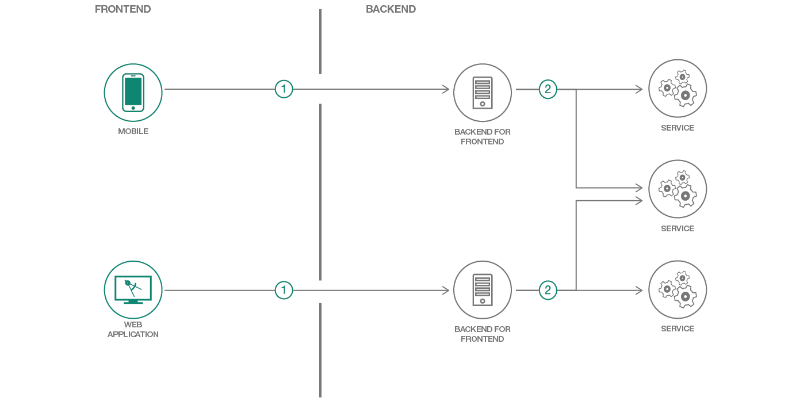

# Create and deploy a Java Backend For Frontend (BFF) using Java EE

> We have similar patterns available for [Node.js](https://github.com/IBM/nodejs-backend-for-frontend), [Swift](https://github.com/IBM/swift-backend-for-frontend), and [Java Spring](https://github.com/IBM/spring-backend-for-frontend) as well!

In this code pattern, you will create a Backend for Frontend (BFF) web service using Java EE [MicroProfile](https://microprofile.io/) running on [WebSphere Liberty](https://developer.ibm.com/wasdev/), matching a RESTful API documented in [Swagger](http://swagger.io).

A BFF can be used to elegantly expose complex backend systems to multiple client-facing platforms, such as iOS and the web, without building a monolothic API that attempts to serve all clients equally. Different types of clients require different types of user experiences, and having a backend API tightly coupled to each specific user experience actually makes for a much more loosely coupled system overall. This pattern helps frontend teams iterate on features faster by giving them more control over the APIs they interact with, without affecting the user experience or development team driving a sister frontend.

When you have completed this code pattern, you will understand how to:

* Build out the Backend for Frontend (BFF) architecture pattern
* Deploy to Kubernetes, Cloud Foundry or a DevOps Pipeline
* Operate an application with monitoring and distributed trace
* Connect to provisioned services

To deploy this application to IBM Cloud using a toolchain click the **Create Toolchain** button.

## Requirements

* [Maven](https://maven.apache.org/install.html)
* Java 8: Any compliant JVM should work.
  * [Java 8 JDK from Oracle](http://www.oracle.com/technetwork/java/javase/downloads/index.html)
  * [Java 8 JDK from IBM (AIX, Linux, z/OS, IBM i)](http://www.ibm.com/developerworks/java/jdk/),
    or [Download a Liberty server package](https://developer.ibm.com/assets/wasdev/#filter/assetTypeFilters=PRODUCT)
    that contains the IBM JDK (Windows, Linux)

## Configuration

The application is configured to provide JAX-RS REST capabilities, JNDI, JSON parsing and Contexts and Dependency Injection (CDI).

These capabilities are provided through dependencies in the pom.xml file and Liberty features enabled in the server config file found in `src/main/liberty/config/server.xml`.

## Project contents

The BFF application has a health endpoint which is accessible at `<host>:<port>/javalibertybackendforfrontend/health`. The context root is set in the `src/main/webapp/WEB-INF/ibm-web-ext.xml` file. The ports are set in the pom.xml file and exposed to the CLI in the cli-config.yml file.

The project contains IBM Cloud specific files that are used to deploy the application as part of a IBM Cloud DevOps flow. The `.bluemix` directory contains files used to define the IBM Cloud toolchain and pipeline for your application. The `manifest.yml` file specifies the name of your application in IBM Cloud, the timeout value during deployment and which services to bind to.

Credentials are either taken from the VCAP_SERVICES environment variable that IBM Cloud provides or from environment variables passed in by JNDI (see the server config file `src/main/liberty/config/server.xml`).

## Run

To build and run the application:

1. `mvn install`
1. `mvn liberty:run-server`

To run the application in Docker use the Docker file called `Dockerfile`. If you do not want to install Maven locally you can use `Dockerfile-tools` to build a container with Maven installed.

## Endpoints

The application exposes the following endpoints:
* Health endpoint: `<host>:<port>/<contextRoot>/health`
* Swagger API: `<host>:<port>/ibm/api/explorer/`, you will need to login with the credentials set in your `server.xml` file. By default these are `guest` and `password`.

The context root is set in the `src/main/webapp/WEB-INF/ibm-web-ext.xml` file. The ports are set in the pom.xml file and exposed to the CLI in the cli-config.yml file.
